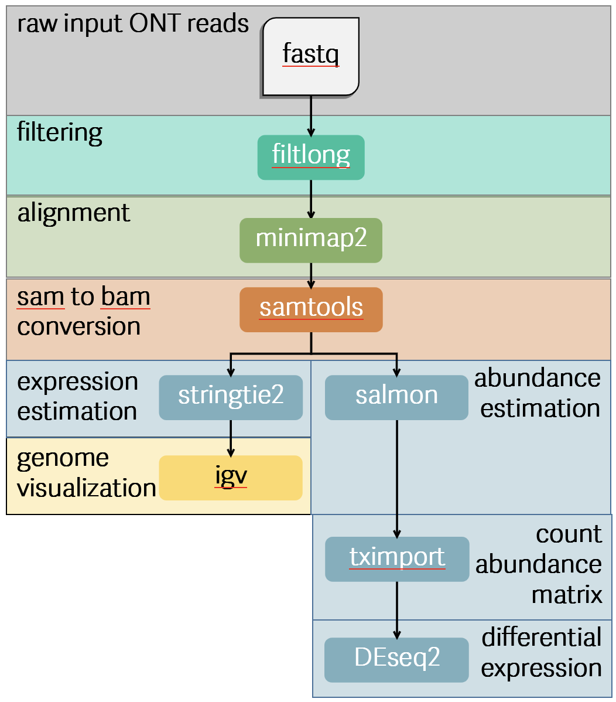
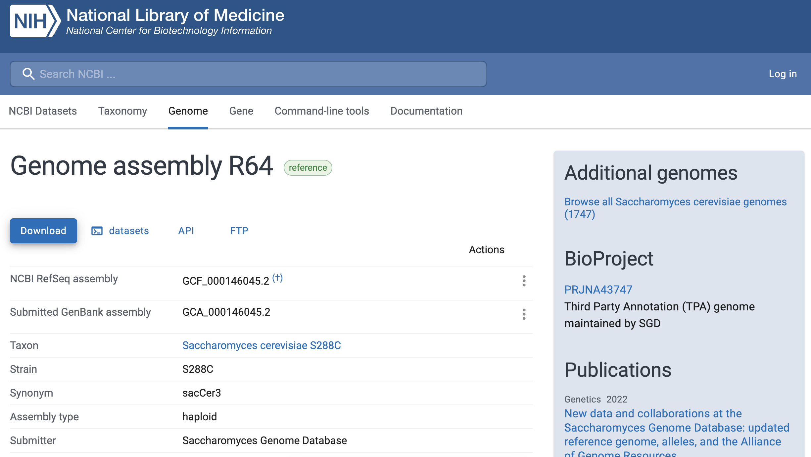
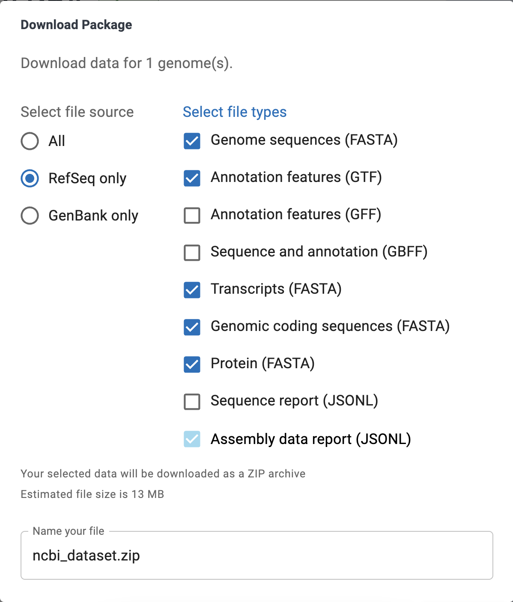

# Facilitating an ONT Direct RNA-Seq Transcriptomic Analysis Workflow

ONT Direct RNA-seq workflows can be complex and readily adapted for use on the Boquerón Cluster; therefore, establishing a reproducible and accessible pipeline to facilitate transcript quantification and other downstream transcriptomic analyses for long read RNA-seq.

Develop a pipeline using programs available on the Boquerón Cluster to perform transcript quantification/abundance from Direct ONT RNA-seq samples. The programs that you will find in this pipeline include data download, basecalling, quality control such as filtering of reads, reference-based alignment and assembly, and differential expression.

This pipeline is designed for PR-INBRE Researchers. PR-INBRE is a network across Puerto Rico biomedical scientists from all levels. We hope to soon convert this into a nextflow pipeline. Please visit their website here: https://inbre.hpcf.upr.edu/ and check them out! :) 

## Content
- [A quick rundown about Oxford Nanopore Sequencing](#a-quick-rundown-about-oxford-nanopore-sequencing)
- [Workflow](#workflow)
- [Data download](#data-download)
- [Basecalling](#basecalling)
- [Perform quality control using Filtlong to filter low quality reads](#perform-quality-control-using-filtlong-to-filter-low-quality-reads)
- [Reference-based alignment using minimap2](#reference-based-alignment-using-minimap2)
- [Assembly using Stringtie2](#assembly-using-stringtie2)
- [Nextflow version](#Nextflow-version-of-the-above-discussion)


## A quick rundown about Oxford Nanopore Sequencing

### Oxford Nanopore Long Read Sequencing

Oxford Nanopore is a third generation sequencer that generates direct reads of DNA and RNA in real-time without the need of labels by the detection of ionic changes given by the molecule sequence when read by the nanopores.

There are three categories of nanopore sequencing:
- cDNA sequencing (based using reverse transcriptase)
- Direct DNA sequencing (great for sequencing native genomic information)
- Direct RNA sequencing (great for sequencing native RNA molecules)

### Advantage and disadvantages of using Oxford Nanopore Long Read Direct RNA Sequencing (dRNA)

Pros:
- RNA modifications preserved which facilitates epitranscriptomic, mRNA processes, RNA splicing, and exitron studies
- RNA abundance and expression at the gene and transcript level 
- Isoform identification 
- Transcript discovery
- Gene fusion
- No need for extra steps such as reverse transcriptase and PCR which can generate artifacts such as “falsitrons” (examples look here: 34183059) the polyadenylated molecules are directly sequenced (34183059)

Cons:
- Pores can get clogged from fragmented RNA molecules
- bacterial transcript lack a Poly(A) tail

### Examples of Oxford Nanopore long read dRNA platforms 

- gridION (capable of running five minion flowcells in parallel)
- Flongle adapter (smaller scale experiments)
- promethION (High throughput, great for larger genomes)
- MinION 1 million reads/sample (probably better for smaller genomes like E. coli, portable)
  - MK1B (USB)
  - MK1C (Touchscreen, internet connection, GPU and CPU integration)
  - MK1D (USB-C, Enhanced temperature control (10-35C))

## Workflow



## Data download

Direct RNA duplex sequencing of S. cerevisiae

Experiment: ribosomal RNA of two  ribosomal RNA of two S. cerevisiae strains are sequenced containing a known (by the researchers) RNA modification
Library name: RDMIN20240308-Mk1C_fast5
Platform: ONT, RNA004 Kit
Strategy: RNA-seq
Source: Transcriptomic
Selection: PolyAdenylation and Polyuridylation
Layout: Single

NCBI Information:
Bioproject: PRJNA1150648, Duplexed Direct RNA Sequencing Protocol Using Polyadenylation and Polyuridylation
Biosample: SAMN43293683
SRA: SRR30335016, Spots: 5.8M, Bases: 2.8G, 2.6GB, GC content: 47.2%
https://trace.ncbi.nlm.nih.gov/Traces/?run=SRR30335016 

Dataset was successfully downloaded to the Boquerón Cluster (https://www.hpcf.upr.edu/documentation/boqueron/) using the following command:

```
mkdir -p /local/jrodriguez4/pod5
cd /local/jrodriguez4/pod5
```

```
wget https://sra-pub-src-1.s3.amazonaws.com/SRR30335016/20240308_Scerevisiae_duplex_004_pod5.tar.gz.1 
```

## Basecalling

We are interested in using `dorado basecaller`. First, I show how I installed dorado.

I did try to install sra tools to use `prefetch` and `fasterq dump`, but my conda environment is old. I shall try again some other time and will just use what I was able to download using `wget`. 

### Dorado basecaller

#### Installing dorado basecaller

At first, I did think that I would be able to use the GPU mode of dorado because my computer does support GPUs. So I started basecalling using dorado.

In a conda environment on my local computer I run the following:

```
curl "https://cdn.oxfordnanoportal.com/software/analysis/dorado-1.4.0-osx-arm64.zip" -o dorado-1.4.0-osx-arm64.tar.gz
```

Added the dorado path to my bashrc file:

```
# >>> Added by Judy Mar 23 for basecalling with dorado>>>
export PATH="$HOME/Downloads/dorado-1.4.0-osx-arm64/bin:$PATH"
# <<< Added by Judt Mar 23 for basecalling with dorado <<<
```

```
source ~/.bashrc
```

#### Basecalling with dorado

To test out how different models would influence basecalling results, I evaluate different basecaller commands. dorado basecaller can identify the type of molecular information there is in the fastq files. I tested both fast and hac models for dorado with trim and no-trim parameters. I even tested specifying the the RNA sequencing kit that was used. Additionally, I tested the guppy basecaller model. To evaluate the basecalling results among these, I used nanoplots and looked at specific categories such as mean read length, mean read quality, total reads, total bases, and read length N50. 

```
##### dorado fast
dorado basecaller fast pod5/ --emit-fastq --device cpu > reads_dorado_rna_trim.fastq
# Nanoplot before filter and trimming
NanoPlot --prefix proj2_ --fastq reads_dorado_rna_trim.fastq --N50 --threads 32
```

```
##### dorado fast no-trim
dorado basecaller fast pod5/ --emit-fastq --no-trim --device cpu > reads_dorado_no-trim.fastq
NanoPlot --prefix proj2_ --fastq reads_dorado_no-trim.fastq --N50 --threads 32
```

```
##### dorado hac no-trim
dorado basecaller hac pod5/ --emit-fastq --no-trim --device cpu > reads_hac_no-trim.fastq
NanoPlot --prefix proj2_ --fastq reads_hac_no-trim.fastq --N50 --threads 32
```

```
########## dorado hac rna trim
dorado basecaller hac pod5/ --emit-fastq --device cpu > reads_hac_rna_trim.fastq
```

```
# specifying rna kit
dorado download --models-directory models/
dorado basecaller models/rna004_130bps_fast@v5.3.0 pod5/ --emit-fastq --device cpu --estimate-poly-a > reads_fast_rna_r9.4.1_trim.fastq 
```

#### Basecalling with guppy

```
# guppy basecaller
guppy_basecaller -i fast5/ -s guppy_rna_fastq/ --config rna_r9.4.1_70bps_hac.cfg -r --num_callers 1 --cpu_threads_per_caller 32
# concatenate fastq files
cat guppy_rna_fastq/*fastq > guppy_rna.fastq
# run nanoplots
NanoPlot --prefix proj2_ --fastq guppy_rna.fastq --N50 --threads 32
```

Below you will notice the basecalling summaries from nanoplots and the runtime summaries of each command.

#### Basecalling Summary

| Basecaller                              | Mean Read Length | Mean Read Quality | Total Reads | Total Bases | Read Length N50 |
|----------------------------------------|------------------|-------------------|------------|-------------|-----------------|
| guppy (rna_r9.4.1_70bps_hac.cfg)       | 467              | 9.1               | 43,973     | 20,535,500  | 1,278           |
| dorado (fast, rna trim, cpu)           | 462.6            | 10                | 45,156     | 20,888,155  | 1,188           |
| dorado (fast, no-trim, cpu)            | 462.6            | 10                | 45,156     | 20,888,357  | 1,188           |
| dorado (hac, rna trim, cpu)            | 477.2            | 11                | 45,175     | 21,556,194  | 1,224           |
| dorado (hac, no-trim, cpu)             | 477.2            | 11                | 45,175     | 21,556,282  | 1,224           |

Since there is not a dramatic difference among these commands and parameters, I decided to go with the dorado hac, no-trim, cpu command.


For those scientists who are curious on runtimes, I have also prepared a runtime table.

#### Runtime Summary

| Basecaller                              | Runtime    | Start                     | End                       |
|----------------------------------------|------------|---------------------------|---------------------------|
| guppy (rna_r9.4.1_70bps_hac.cfg)       | 01:51:33   | N/A                       | N/A                       |
| dorado (fast, rna trim, cpu)           | N/A        | 2026-03-24 09:06:27.027   | 2026-03-24 10:19:51.134   |
| dorado (fast, no-trim, cpu)            | N/A        | 2026-03-24 11:12:53.351   | 2026-03-24 12:22:11.266   |
| dorado (hac, rna trim, cpu)            | 05:22:54   | 2026-03-26 11:47:33.354   | 2026-03-26 17:10:26.938   |
| dorado (hac, no-trim, cpu)             | 04:47:33   | 2026-03-25 18:13:29.524   | 2026-03-25 23:01:01.144   |


## Perform quality control using Filtlong to filter low quality reads

If you noticed, I am not going to use a trimming tool like porechop. I assumed that if there was not a difference among the nanoplots when using or not using the parameters no-trim that maybe these files have already been trimmed. Additionally, it was not completely clear to me whether porechop can be adequately used on ONT RNA sequencing reads (something I should oduble check), so I continued my pipeline with filtlong.

### Parameters for filtlong

| Min Length | Min Mean Q | Output Filename |
|------------|------------|--------------------------------------------------|
| 800        | 8          | SRR30335016_filtlong_min_length_800_mean_q_8.fastq |
| 1000       | 7          | SRR30335016_filtlong_min_length_1000_mean_q_7.fastq |


The following commands were used to test these parameters and executed on the Boquerón Cluster.

To filter reads using filtlong, I provide an example of one of the these commands. In the following command you will notice that I use the min_mean_q and min_length parameters. The min_mean_q allows me to set a phred quality score of 8 and the min_length parameters let's me set a minimum length of 800bp for desired reads.

```
filtlong --min_mean_q 8 --min_length 800 ../SRR30335016.fastq.gz > SRR30335016_filtlong.fastq
```

### Comparison of generated filtlong reads using nanoplot

Afterwards, I analyzed and compared the generated filtlong reads to know how well the filtering process generated my new fastq files. The first 

```
mkdir nanoplots_SRR30335016_filtlong_min_length_800_mean_q_8
cd nanoplots_SRR30335016_filtlong_min_length_800_mean_q_8
```

```
module load albacore/2.3.4 

```

```
NanoPlot --prefix SRR30335016_filtlong_min_length_800_mean_q_8_ --fastq SRR30335016_filtlong_min_length_800.fastq --N50 --threads 32
```
### Read Filtering Summary (by Minimum Length and Quality Phred Score)

| Min Length | Min mean q | Mean Read Length | Mean Read Quality | Total Reads | Total Bases | Read Length N50 |
|------------|------------|------------------|-------------------|----------------|-------------|-----------------|
| 800       | 8       | 1,672.1          | 9.7               | 1,129,147.0       | 1,888,073,600   | 1,760.0           |
| 1000      | 7       | 1,856.2          | 9.8              | 1,694,922,252       | 7,628,283   | 1,885.0           |


## Reference-based alignment using minimap2

We need to align our ONT dRNA-seq reads in order to assemble them using Stringtie2. 

### Reference used

Firstly, I need a reference to align my reads. I am using the following dataset: https://www.ncbi.nlm.nih.gov/datasets/genome/GCF_000146045.2/



Now make sure that you have all that you need. You will download from RefSeq for Genome sequences (FASTA) and Annotation Features (GTF). 


### minimap2

```
module load minimap2/ac33463
```

```
minimap2 -ax splice reference_data/ncbi_dataset/data/GCA_000146045.2/GCA_000146045.2_R64_genomic.fna SRR30335016_filtlong_min_length_800_mean_q_8/SRR30335016_filtlong_min_length_800_mean_q_8.fastq > SRR30335016_minimap2_alignment_filtlong_min_length_800_mean_q_8.sam
```
## Assembly using Stringtie2

Structural annotations of transcriptome using Stringtie2

Now I have a sam file that I need to convert to a sorted bam file. I first load and run samtools. Then, I will be able to execute Stringtie2.

### samtools

```
module load samtools/1.13
```

```
samtools view -Su SRR30335016_minimap2_alignment_refseq_transcriptome_filtlong_min_length_800_mean_q_8.sam | samtools sort > SRR30335016_minimap2_alignment_refseq_transcriptome_filtlong_min_length_800_mean_q_8.sorted.bam
```

### Stringtie2

```
module load stringtie/2.1.6
```

```
stringtie SRR30335016_minimap2_alignment_refseq_transcriptome_filtlong_min_length_800_mean_q_8.sorted.bam -o SRR30335016_stringtie2_gff_guided_minimap2_alignment_refseq_transcroptome_filtlong_min_length_800_mean_q_8.gtf -L -p 32 -G ../reference_data/refseq/ncbi_dataset/data/GCF_000146045.2/genomic.gff
```
## IGV

Make sure to have indexed file for this step

```
samtools index SRR30335016_minimap2_alignment_refseq_transcriptome_filtlong_min_length_800_mean_q_8.sorted.bam
```

The following files are required to view stringtie assembly:

|  input|Filename|
|-----|--------|
|   genome FASTA    |
| BAM alignment     |  SRR30335016_minimap2_alignment_refseq_transcriptome_filtlong_min_length_800_mean_q_8.sorted.bam  |
|  BAM index (.bai) |  SRR30335016_minimap2_alignment_refseq_transcriptome_filtlong_min_length_800_mean_q_8.sorted.bai  |
|   StringTie GTF   |
|   reference GTF   |

## Differential Expression

### salmon

In order to perform differential expression, we need to quantify the reads for each transcript, we can use salmon. We need to first create an index from a reference using `salmon index`. Once we have created an index, we can use `salmon quant` to quantify our reads.

```
# Load module for Boquerón Cluster
module load salmon/0.8.2
```

```
salmon index -t ../reference_data/refseq/ncbi_dataset/data/GCF_000146045.2/rna.fna -i salmon_index_SRR30335016_minimap2_alignment_refseq_transcriptome_filtlong_min_length_800_mean_q_8 -k 31
```

```
salmon quant -t ../reference_data/refseq/ncbi_dataset/data/GCF_000146045.2/rna.fna -l A -a SRR30335016_minimap2_alignment_refseq_transcriptome_filtlong_min_length_800_mean_q_8.sorted.bam -o salmon_quant_SRR30335016_minimap2_alignment_refseq_transcriptome_filtlong_min_length_800_mean_q_8 --threads 32
```

### differential expression

tximport and deseq2


## Running canu for error correction

```
canu -p SRR30335016_Scerevisiae -d canu_error_correction_nanopore_test_after_filtlong_minlen_800_assembly genomeSize=28m -nanopore ../SRR30335016_filtlong_min_len_800_on_fastq_complete_data_download/SRR30335016_filtlong_min_length_800.fastq
```

## Nextflow version of the above discussion

To review current status of nextflow pipeline, please execute `nextflow run main.nf -preview`

Or refer to the code here: https://github.com/bioinfwithjudith/ONT_RNA_Assembly_PR-INBRE_pipeline/tree/main/genome_expression_nextflow_pipeline 


